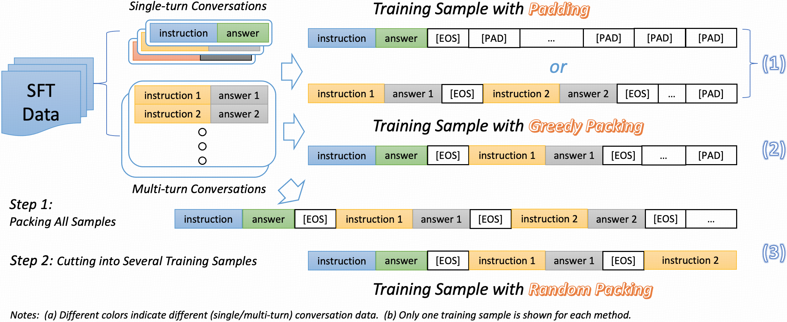

# Packing Analysis: Packing Is More Appropriate for Large Models or Datasets in Supervised Fine-tuning

This repo is for our paper: [Packing Analysis: Packing Is More Appropriate for Large Models or Datasets in Supervised Fine-tuning](). 

## Upate

* October 6, 2023 we released our scripts, checkpoints and data.
* October 6, 2024 we released our paper in [arxiv]().
****

## Links
- [Packing Analysis: Packing Is More Appropriate for Large Models or Datasets in Supervised Fine-tuning](#packing-analysis-packing-is-more-appropriate-for-large-models-or-datasets-in-supervised-fine-tuning)
  - [Upate](#upate)
  - [Links](#links)
  - [Introduction](#introduction)
  - [Reproduce](#reproduce)
    - [Step 1: Requriements](#step-1-requriements)
    - [Step 2:Data Preparation](#step-2data-preparation)
      - [1. Download Training Data](#1-download-training-data)
      - [2. Data Preparation](#2-data-preparation)
    - [Step 3: Fine-tuning](#step-3-fine-tuning)
    - [Step 5: Results](#step-5-results)
  - [Contact](#contact)

## Introduction
Packing, initially utilized in the pre-training phase, is an optimization technique designed to maximize hardware resource efficiency by combining different training sequences to fit the model's maximum input length.
Although it has demonstrated effectiveness during pre-training, there remains a lack of comprehensive analysis for the supervised fine-tuning (SFT) stage on the following points:
(1) whether packing can effectively enhance training efficiency while maintaining performance, (2) the suitable size of the model and dataset for fine-tuning with the packing method, and (3) whether packing unrelated or related training samples might cause the model to either excessively disregard or over-rely on the context.

To address these concerns, here, we provide a thorough analysis of packing during the supervised fine-tuning (SFT) stage.
Specifically, we perform extensive comparisons between supervised fine-tuning (SFT) methods using padding and packing, covering SFT datasets ranging from 69K to 1.2M and models from 8B to 70B. Our comparisons include various benchmarks, such as knowledge, reasoning, and coding, GPT-based evaluations, time efficiency, and other fine-tuning parameters, concluding that:

1. Models using packing generally perform better on average compared to those using padding across various benchmarks.
2. As the model size grows, the performance gap between padding and packing-based models on the benchmark increases.
3. Tailoring the packing of specific training samples may result in desired performance on specific benchmarks.
4. Compared to padding, the packing method greatly reduces training time, making it possible to fine-tune large models on large datasets.
5. Using longer training samples increases the time required for the packing method to process each sample, making it less suitable for training on particularly small datasets.
6. In packing mode, the batch size is no longer directly proportional to the learning rate.
7. Applying packing to datasets with only single-turn conversations may lead to a significant decrease in performance on few-shot benchmarks.


Illustraitions for our comparisons is following:




## Reproduce

### Step 1: Requriements
We use [LLaMA-Factory](https://github.com/hiyouga/LLaMA-Factory) as our codebase. To get started, please first ```clone``` this repo and then run:
```
pip install -e ".[torch,metrics]"
```

### Step 2:Data Preparation
In this part, we offer links to download our training data.

#### 1. Download Training Data
* [WildChat (GPT-4)](https://huggingface.co/datasets/Super-shuhe/packing-wildchat-gpt-4)
* [TULU](https://huggingface.co/datasets/Super-shuhe/packing-tulu)
* [WildChat](https://huggingface.co/datasets/Super-shuhe/packing-wildchat)
* [Open-source 1M](https://huggingface.co/datasets/Super-shuhe/open-source-1M)

**Please cite the original data when using it.**

#### 2. Data Preparation
After downloading the data, move them to the data folder, like:
```
mv wildchat_gpt.json ./data
```
Then, folloing the format below to update the file ```data/dataset_info.json```:
```
"wildchat_gpt": {
    "file_name": "wildchat_gpt.json",
    "formatting": "sharegpt",
    "columns": {
      "messages": "conversations"
    }
```


### Step 3: Fine-tuning


1. Download backboned LLaMA models:
   1. [LLaMA-3-8B](https://huggingface.co/meta-llama/Meta-Llama-3-8B)
   2. [LLaMA-3-70B](https://huggingface.co/meta-llama/Meta-Llama-3-70B)
2. Fill the `MODEL`, `DATANAME` and `OUTPUTDIR` into our provided training scripts:
   1. LLaMA-3-8B
      1. single node: `./train_scripts/llama_3_8B/single_node.sh`
      2. multi node: `./train_scripts/llama_3_8B/multi_node.sh`
   2. LLaMA-3-70B
      1. multi node: `./train_scripts/llama_3_70B/multi_node.sh`
3. Run the training scirpt, such as: `bash ./train_scripts/llama_3_8B/multi_node.sh`


### Step 5: Results
Table 1: Results of different size models and datasets on various benchmarks.
<table border=2>
    <tr>
        <td align="left"><b> Model </b> </td>
        <td align="center"><b> MMLU (5-shot) </b> </td>
        <td align="center"><b> GSM8K (4-shot) </b> </td>
        <td align="center"><b> MATH (4-shot) </b> </td>
        <td align="center"><b> BBH (3-shot) </b> </td>
        <td align="center"><b> IFEval (0-shot) </b> </td>
        <td align="center"><b> HumanEval (0-shot) </b> </td>
        <td align="center"><b> Avg </b> </td>
    </tr>
    <tr>
        <td align="center" colspan="8"> WildChat (GPT-4) Dataset, Size: 69K </td> 
    </tr>
    <tr>
        <td align="center" colspan="8"> LLaMA-3-8B </td> 
    </tr>
    <tr>
        <td>Padding</td> 
        <td>63.99</td> 
        <td>58.76</td> 
        <td>14.72</td>
        <td>60.71</td>
        <td>56.01</td>
        <td>43.29</td>
        <td>49.58</td>
    </tr>
    <tr>
        <td>Random Packing</td> 
        <td>63.5(-0.44) </td> 
        <td>61.18(+2.42)</td> 
        <td>15.58(+0.86)</td>
        <td>61.04(+0.33)</td>
        <td>51.57(-4.44)</td>
        <td>43.9 (+0.61)</td>
        <td>49.46(-0.12)</td>
    </tr>
    <tr>
        <td>Greedy Packing</td> 
        <td>64.71(+0.72)</td> 
        <td>60.88(+2.12)</td> 
        <td>15.6(+0.88)</td>
        <td>62.59(+1.88)</td>
        <td>57.12(+1.11)</td>
        <td>42.68(-0.61)</td>
        <td>50.6(+1.02)</td>
    </tr>
    <tr>
        <td align="center" colspan="8"> LLaMA-3-70B </td> 
    </tr>
    <tr>
        <td>Padding</td> 
        <td>73.47</td> 
        <td>79.3</td> 
        <td>28.8</td>
        <td>78.33</td>
        <td>51.76</td>
        <td>57.32</td>
        <td>61.50</td>
    </tr>
    <tr>
        <td>Random Packing</td> 
        <td>75.16(+1.69)</td> 
        <td>82.38(+3.08)</td> 
        <td>31.46(+2.66)</td>
        <td>79.94(+1.61)</td>
        <td>61.00(+9.24)</td>
        <td>65.85(+8.53)</td>
        <td>65.97(+4.47)</td>
    </tr>
    <tr>
        <td>Greedy Packing</td> 
        <td>74.77(+1.3)</td> 
        <td>81.61(+2.31)</td> 
        <td>32.84(+4.04)</td>
        <td>80.98(+2.65)</td>
        <td>64.33(+12.57)</td>
        <td>60.98(+3.66)</td>
        <td>65.92(+4.42)</td>
    </tr>
    <tr>
        <td align="center" colspan="8"> TULU Dataset, Size: 326K </td> 
    </tr>
    <tr>
        <td align="center" colspan="8"> LLaMA-3-8B </td> 
    </tr>
    <tr>
        <td>Padding</td> 
        <td>62.26</td> 
        <td>57.32</td> 
        <td>14.6</td>
        <td>60.14</td> 
        <td>41.77</td> 
        <td>44.24</td>
        <td>46.72</td> 
    </tr> 
    <tr>
        <td>Random Packing</td> 
        <td>63.94(+1.68)</td> 
        <td>58.83(+1.51)</td> 
        <td>13.94(-0.66)</td>
        <td>61.11(+0.97)</td> 
        <td>42.51(+0.74)</td> 
        <td>45.61(+1.37)</td>
        <td>47.66(+0.94)</td> 
    </tr> 
    <tr>
        <td>Greedy Packing</td> 
        <td>62.14(-0.12)</td> 
        <td>60.8(+3.48)</td> 
        <td>14.74(+0.14)</td>
        <td>61.26(+1.12)</td> 
        <td>46.40(+4.63)</td> 
        <td>44.51(+0.27)</td>
        <td>48.31(+1.59)</td> 
    </tr> 
    <tr>
        <td align="center" colspan="8"> LLaMA-3-70B </td> 
    </tr>
    <tr>
        <td>Padding</td> 
        <td>73.2</td> 
        <td>81.18</td> 
        <td>29.02</td>
        <td>78.06</td> 
        <td>47.32</td> 
        <td>62.95</td>
        <td>61.96</td> 
    </tr> 
    <tr>
        <td>Random Packing</td> 
        <td>73.48(+0.28)</td> 
        <td>81.73(+0.55)</td> 
        <td>29.42(+0.4)</td>
        <td>78.35(+0.29)</td> 
        <td>47.29(-0.03)</td> 
        <td>60.37(-2.58)</td>
        <td>61.77(-0.19)</td> 
    </tr>
    <tr>
        <td>Greedy Packing</td> 
        <td>73.43(+0.23)</td> 
        <td>81.2(+0.02)</td> 
        <td>30(+0.18)</td>
        <td>77.54(-0.52)</td> 
        <td>53.05(+5.73)</td> 
        <td>68.9(+5.95)</td>
        <td>64.02(+2.06)</td> 
    </tr>
    <tr>
        <td align="center" colspan="8"> WildChat Dataset, Size: 652K </td> 
    </tr>
    <tr>
        <td align="center" colspan="8"> LLaMA-3-8B </td> 
    </tr>
    <tr>
        <td>Padding</td> 
        <td>64.52</td> 
        <td>61.83</td> 
        <td>14.21</td>
        <td>61.88</td> 
        <td>51.36</td> 
        <td>40.12</td>
        <td>48.99</td> 
    </tr> 
    <tr>
        <td>Random Packing</td> 
        <td>64.46(-0.06)</td> 
        <td>62.77(+0.94)</td> 
        <td>14.44(+0.23)</td>
        <td>62(+0.12)</td> 
        <td>50.28(-1.08)</td> 
        <td>40.24(+0.12)</td>
        <td>49.03(+0.04)</td> 
    </tr> 
    <tr>
        <td>Greedy Packing</td> 
        <td>65.07(+0.55)</td> 
        <td>61.41(-0.42)</td> 
        <td>15.08(+0.87)</td>
        <td>62.83(+0.95)</td> 
        <td>52.68(+1.32)</td> 
        <td>48.17(+8.05)</td>
        <td>50.87(+1.88)</td> 
    </tr>
    <tr>
        <td align="center" colspan="8"> LLaMA-3-70B </td> 
    </tr>
    <tr>
        <td>Padding</td> 
        <td>74.82</td> 
        <td>79.26</td> 
        <td>29.44</td>
        <td>76.31</td> 
        <td>52.19</td> 
        <td>63.7</td>
        <td>62.62</td> 
    </tr> 
    <tr>
        <td>Random Packing</td> 
        <td>75.67(+0.85)</td> 
        <td>80.1(+0.84)</td> 
        <td>30.37(+0.93)</td>
        <td>76.74(+0.43)</td> 
        <td>52.43(+0.24)</td> 
        <td>65.26(+1.56)</td>
        <td>63.43(+0.81)</td> 
    </tr> 
    <tr>
        <td>Greedy Packing</td> 
        <td>75.36(+0.46)</td> 
        <td>79.45(+0.19)</td> 
        <td>31.28(+1.84)</td>
        <td>77.47(+1.16)</td> 
        <td>53.60(+1.41)</td> 
        <td>64.02(+0.32)</td>
        <td>63.53(+0.91)</td> 
    </tr>
    <tr>
        <td align="center" colspan="8"> Open-source 1M Dataset, Size: 1.2M </td> 
    </tr>
    <tr>
        <td align="center" colspan="8"> LLaMA-3-8B </td> 
    </tr>
    <tr>
        <td>Padding</td> 
        <td>63.7</td> 
        <td>77.08</td> 
        <td>27.96</td>
        <td>63.45</td> 
        <td>48.39</td> 
        <td>45.22</td>
        <td>54.3</td> 
    </tr> 
    <tr>
        <td>Random Packing</td> 
        <td>63.96(0.26)</td> 
        <td>77.26(+0.16)</td> 
        <td>28.4(+0.44)</td>
        <td>64.83(+1.38)</td> 
        <td>49.54(+1.15)</td> 
        <td>45.73(+0.51)</td>
        <td>54.95(+0.65)</td> 
    </tr> 
    <tr>
        <td>Greedy Packing</td> 
        <td>63.63(-0.07)</td> 
        <td>77.48(+0.4)</td> 
        <td>28.26(+0.3)</td>
        <td>63.01(-0.44)</td> 
        <td>51.57(+3.28)</td> 
        <td>46.34(+1.12)</td>
        <td>55.05(+0.75)</td> 
    </tr>
    <tr>
        <td align="center" colspan="8"> LLaMA-3-70B </td> 
    </tr>
    <tr>
        <td>Padding</td> 
        <td>74.97</td> 
        <td>85.23</td> 
        <td>41.82</td>
        <td>78.65</td> 
        <td>54.33</td> 
        <td>61.74</td>
        <td>66.12</td> 
    </tr> 
    <tr>
        <td>Random Packing</td> 
        <td>76.38(+1.41)</td> 
        <td>86.14(+0.91)</td> 
        <td>42.73(+0.91)</td>
        <td>79.42(+0.77)</td> 
        <td>55.9(+1.57)</td> 
        <td>62.98(+1.24)</td>
        <td>67.26(+1.14)</td> 
    </tr> 
    <tr>
        <td>Greedy Packing</td> 
        <td>75.69(+0.72)</td> 
        <td>86.88(+1.65)</td> 
        <td>42.92(+1.1)</td>
        <td>79.94(+1.29)</td> 
        <td>56.82(+2.49)</td> 
        <td>62.98(+1.24)</td>
        <td>67.54(+1.42)</td> 
    </tr>
    
</table>


Table 2: Results of different size models and datasets on the WildBench benchmark.
<table border=2>
    <tr>
        <td align="left"><b> Model </b> </td>
        <td align="center"><b> WildChat (GPT-4), 69K</b> </td>
        <td align="center"><b> TULU, 326K </b> </td>
        <td align="center"><b> WildChat, 652K </b> </td>
        <td align="center"><b> Open-source 1M, 1.2M </b> </td>
    </tr>
    <tr>
        <td align="center" colspan="5"> LLaMA-3-8B </td> 
    </tr>
    <tr>
        <td>Padding</td> 
        <td>28.86</td> 
        <td>19.11</td> 
        <td>21.06</td>
        <td>18.38</td>
    </tr>
    <tr>
        <td>Random Packing</td> 
        <td>27.89(-0.97)</td> 
        <td>20.84(+1.73)</td> 
        <td>20.73(-0.33)</td>
        <td>20.42(+2.04)</td>
    </tr>
    <tr>
        <td>Greedy Packing</td> 
        <td>29.81(+0.95)</td> 
        <td>20.73(+1.62)</td> 
        <td>21.34(+0.28)</td>
        <td>21.9(+3.52)</td>
    </tr>
    <tr>
        <td align="center" colspan="5"> LLaMA-3-70B </td> 
    </tr>
    <tr>
        <td>Padding</td> 
        <td>37.0</td> 
        <td>22.84</td> 
        <td>30.69</td>
        <td>34.95</td>
    </tr>
    <tr>
        <td>Random Packing</td> 
        <td>39.92(+2.92)</td> 
        <td>23.93(+1.09)</td> 
        <td>30.76(+0.07)</td>
        <td>35.21(+0.26)</td>
    </tr>
    <tr>
        <td>Greedy Packing</td> 
        <td>41.09(+4.09)</td> 
        <td>24.46(+1.62)</td> 
        <td>31.26(+0.57)</td>
        <td>35.81(+0.86)</td>
    </tr>
</table>


Table 3: The training time of models across various datasets, with blue indicating an improvement over the padding
method, while red represents a decrease in performance compared to the padding method.
<table border=2>
    <tr>
        <td align="left"><b> Model </b> </td>
        <td align="center"><b> Epoch</b> </td>
        <td align="center"><b> Total Steps </b> </td>
        <td align="center"><b> Total Training Time (s)↓ </b> </td>
        <td align="center"><b> Steps per Second↑ </b> </td>
        <td align="center"><b> Samples per Second↑ </b> </td>
    </tr>
    <tr>
        <td align="center" colspan="6"> WildChat (GPT-4) Dataset, Size: 69K </td> 
    </tr>
    <tr>
        <td align="center" colspan="6"> LLaMA-3-8B </td> 
    </tr>
    <tr>
        <td>Padding</td> 
        <td>4</td> 
        <td>1964</td> 
        <td>1188.8449</td>
        <td>0.165</td>
        <td>21.13</td>
    </tr>
    <tr>
        <td>Random Packing</td> 
        <td>4</td> 
        <td>728</td> 
        <td>445.28773(-743.55717)</td>
        <td>0.163(-0.002)</td>
        <td>20.934(-0.196)</td>
    </tr>
    <tr>
        <td>Greedy Packing</td> 
        <td>4</td> 
        <td>492</td> 
        <td>308.33346(-880.51144)</td>
        <td>0.16(-0.005)</td>
        <td>20.48(-0.65)</td>
    </tr>
    <tr>
        <td align="center" colspan="6"> LLaMA-3-70B </td> 
    </tr>
    <tr>
        <td>Padding</td> 
        <td>3</td> 
        <td>2943</td> 
        <td>9533.42936</td>
        <td>0.031</td>
        <td>1.976</td>
    </tr>
    <tr>
        <td>Random Packing</td> 
        <td>3</td> 
        <td>1092</td> 
        <td>3749.3016(-5784.12776)</td>
        <td>0.029(-0.002)</td>
        <td>1.865(-0.111)</td>
    </tr>
    <tr>
        <td>Greedy Packing</td> 
        <td>3</td> 
        <td>741</td> 
        <td>2573.34781(-6960.08155)</td>
        <td>0.029(-0.002)</td>
        <td>1.84(-0.136)</td>
    </tr>
    <tr>
        <td align="center" colspan="6"> TULU Dataset, Size: 326K </td> 
    </tr>
    <tr>
        <td align="center" colspan="6"> LLaMA-3-8B </td> 
    </tr>
    <tr>
        <td>Padding</td> 
        <td>4</td> 
        <td>9183</td> 
        <td>4906.59014</td>
        <td>0.165</td> 
        <td>21.084</td> 
    </tr> 
    <tr>
        <td>Random Packing</td> 
        <td>4</td> 
        <td>1928</td> 
        <td>1175.43583(-3731.15431)</td>
        <td>0.164(-0.001)</td> 
        <td>20.977(-0.107)</td> 
    </tr> 
    <tr>
        <td>Greedy Packing</td> 
        <td>4</td> 
        <td>1956</td> 
        <td>1328.12592(-3578.46422)</td>
        <td>0.147(-0.018)</td> 
        <td>18.841(-2.243)</td> 
    </tr> 
    <tr>
        <td align="center" colspan="6"> LLaMA-3-70B </td> 
    </tr>
    <tr>
        <td>Padding</td> 
        <td>3</td> 
        <td>13761</td> 
        <td>40735.40051</td>
        <td>0.034</td> 
        <td>2.162</td> 
    </tr> 
    <tr>
        <td>Random Packing</td> 
        <td>3</td> 
        <td>2889</td> 
        <td>9758.68127(-30976.71924)</td>
        <td>0.03(-0.004)</td> 
        <td>1.895(-0.267)</td> 
    </tr>
    <tr>
        <td>Greedy Packing</td> 
        <td>3</td> 
        <td>2931</td> 
        <td>10313.89593(-30421.50458)</td>
        <td>0.028(-0.006)</td> 
        <td>1.82(-0.342)</td> 
    </tr>
    <tr>
        <td align="center" colspan="6"> WildChat Dataset, Size: 652K </td> 
    </tr>
    <tr>
        <td align="center" colspan="6"> LLaMA-3-8B </td> 
    </tr>
    <tr>
        <td>Padding</td> 
        <td>4</td> 
        <td>18340</td> 
        <td>11738.48881</td>
        <td>0.156</td> 
        <td>20.183</td> 
    </tr> 
    <tr>
        <td>Random Packing</td> 
        <td>4</td> 
        <td>5348</td> 
        <td>3422.97918(-8315.50963)</td>
        <td>0.156</td> 
        <td>20.006(-0.177)</td> 
    </tr> 
    <tr>
        <td>Greedy Packing</td> 
        <td>4</td> 
        <td>4780</td> 
        <td>3124.28736(-8614.20145)</td>
        <td>0.153(-0.003)</td> 
        <td>19.58(-0.603)</td> 
    </tr>
    <tr>
        <td align="center" colspan="6"> LLaMA-3-70B </td> 
    </tr>
    <tr>
        <td>Padding</td> 
        <td>3</td> 
        <td>27510</td> 
        <td>97893.95669</td>
        <td>0.034</td> 
        <td>2.261</td>
    </tr> 
    <tr>
        <td>Random Packing</td> 
        <td>3</td> 
        <td>8025</td> 
        <td>28904.78592(-68989.17077)</td>
        <td>0.030(-0.004)</td> 
        <td>2.083(-0.178)</td>
    </tr> 
    <tr>
        <td>Greedy Packing</td> 
        <td>3</td> 
        <td>7170</td> 
        <td>25124.6234(-72769.33329)</td>
        <td>0.029(-0.005)</td> 
        <td>1.826(-0.435)</td>
    </tr>
    <tr>
        <td align="center" colspan="6"> Open-source 1M Dataset, Size: 1.2M </td> 
    </tr>
    <tr>
        <td align="center" colspan="6"> LLaMA-3-8B </td> 
    </tr>
    <tr>
        <td>Padding</td> 
        <td>4</td> 
        <td>33064</td> 
        <td>19918.48664</td>
        <td>0.168</td> 
        <td>21.413</td> 
    </tr> 
    <tr>
        <td>Random Packing</td> 
        <td>4</td> 
        <td>5400</td> 
        <td>3253.07972(-16665.40692)</td>
        <td>0.166(-0.002)</td> 
        <td>21.255(-0.158)</td>
    </tr> 
    <tr>
        <td>Greedy Packing</td> 
        <td>4</td> 
        <td>5104</td> 
        <td>3175.09395(-16743.39269)</td>
        <td>0.161(-0.007)</td> 
        <td>20.571(-0.842)</td> 
    </tr>
    <tr>
        <td align="center" colspan="6"> LLaMA-3-70B </td> 
    </tr>
    <tr>
        <td>Padding</td> 
        <td>3</td> 
        <td>49596</td> 
        <td>184709.04470</td>
        <td>0.031</td> 
        <td>2.306</td> 
    </tr> 
    <tr>
        <td>Random Packing</td> 
        <td>3</td> 
        <td>8103</td> 
        <td>29893.65963(-154815.38507)</td>
        <td>0.03(-0.001)</td> 
        <td>2.193(-0.113)</td> 
    </tr> 
    <tr>
        <td>Greedy Packing</td> 
        <td>3</td> 
        <td>7653</td> 
        <td>27426.66515(-157282.37955)</td>
        <td>0.028(-0.003)</td> 
        <td>1.786(-0.52)</td> 
    </tr>
    
</table>


## Contact
If you have any issues or questions about this repo, feel free to contact shuhewang@student.unimelb.edu.au